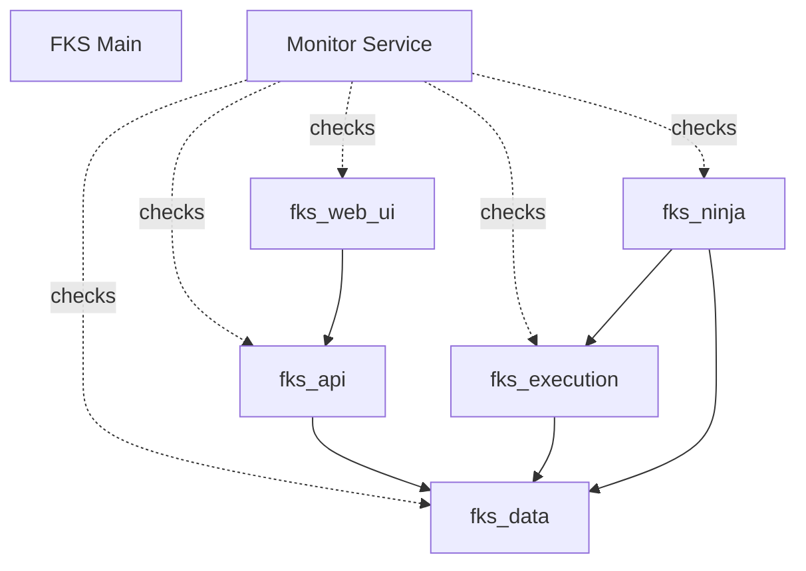

# Multi-Repo Microservices - Quick Reference

## Quick Start

```bash
# Build all microservices
make multi-build

# Start all microservices
make multi-up

# Check status
make multi-status

# Register services with monitor
make register-services

# Open monitoring dashboard
make monitor-dashboard
```

---

## All Multi-Repo Commands

| Command | Description |
|---------|-------------|
| `make multi-up` | Start all FKS microservices (auto-updates submodules) |
| `make multi-down` | Stop all microservices |
| `make multi-logs` | View logs from all microservices (follow mode) |
| `make multi-build` | Build all microservice Docker images |
| `make multi-status` | Show status of all microservices + health checks |
| `make multi-update` | Update all Git submodules to latest |
| `make multi-health` | Run health check on all services |
| `make monitor-dashboard` | Open service monitoring dashboard in browser |
| `make register-services` | Register microservices with monitor service |

---

## Service Access URLs

| Service | Internal URL | External URL | Description |
|---------|-------------|--------------|-------------|
| **FKS Main** | `http://web:8000` | http://localhost:8000 | Main Django application |
| **Monitor** | `http://web:8000/monitor/` | http://localhost:8000/monitor/ | Service monitoring dashboard |
| **FKS API** | `http://fks_api:8001` | - | API Gateway (internal only) |
| **FKS Data** | `http://fks_data:8002` | - | Data ingestion service |
| **FKS Execution** | `http://fks_execution:8003` | - | Trade execution engine |
| **FKS Ninja** | `http://fks_ninja:8004` | - | NinjaTrader bridge |
| **FKS Web UI** | `http://fks_web_ui:3001` | http://localhost:3001 | React SPA |

---

## Health Check Endpoints

All services expose a standard `/health` endpoint:

```bash
# Check main service
curl http://localhost:8000/health

# Check all services via monitor
curl http://localhost:8000/monitor/api/health/

# Check specific microservice (internal)
docker-compose exec web curl http://fks_api:8001/health
```

**Health Check Response Format:**
```json
{
  "status": "healthy",
  "service": "fks_api",
  "version": "1.0.0",
  "dependencies": {
    "database": "healthy",
    "redis": "healthy"
  }
}
```

---

## Service Dependencies



---

## Docker Compose Services

### Core Services (Always Running)
- `web` - Main Django application (port 8000)
- `db` - PostgreSQL with TimescaleDB + pgvector
- `redis` - Redis cache and message broker
- `celery_worker` - Celery worker for async tasks
- `celery_beat` - Celery scheduler for periodic tasks

### Microservices (Started with `make multi-up`)
- `fks_api` - API Gateway (port 8001)
- `fks_data` - Data ingestion (port 8002)
- `fks_execution` - Trade execution (port 8003)
- `fks_ninja` - NinjaTrader bridge (port 8004)
- `fks_web_ui` - React SPA (port 3001)

### Monitoring Stack
- `grafana` - Metrics visualization (port 3000)
- `prometheus` - Metrics collection (port 9090)
- `node-exporter` - System metrics exporter

### Admin Tools
- `pgadmin` - PostgreSQL admin (port 5050)
- `flower` - Celery task monitor (port 5555)

---

## Environment Variables

### Required for All Microservices
```bash
SERVICE_NAME=fks_api          # Unique service identifier
MONITOR_URL=http://web:8000/monitor/api/discover/
DATABASE_URL=postgresql://fks_user:password@db:5432/trading_db
REDIS_URL=redis://redis:6379/2
```

### Service-Specific Variables

**fks_data:**
```bash
BINANCE_API_KEY=your_key
BINANCE_API_SECRET=your_secret
```

**fks_execution:**
```bash
DATA_SERVICE_URL=http://fks_data:8002
```

**fks_ninja:**
```bash
NINJATRADER_HOST=host.docker.internal
NINJATRADER_PORT=47740
EXECUTION_SERVICE_URL=http://fks_execution:8003
```

**fks_web_ui:**
```bash
NODE_ENV=production
VITE_API_URL=http://fks_api:8001
```

---

## Git Submodules

### Initial Setup
```bash
# Add all microservices as submodules
git submodule add https://github.com/nuniesmith/fks-api.git repo/api
git submodule add https://github.com/nuniesmith/fks-data.git repo/data
git submodule add https://github.com/nuniesmith/fks-execution.git repo/execution
git submodule add https://github.com/nuniesmith/fks-ninja.git repo/ninja
git submodule add https://github.com/nuniesmith/fks-web-ui.git repo/web

# Commit and push
git commit -m "feat: Add microservices as Git submodules"
git push
```

### Update Submodules
```bash
# Update all to latest
make multi-update

# Or manually
git submodule update --remote --recursive

# Check status
git submodule status
```

### Clone Repository with Submodules
```bash
# Clone with submodules
git clone --recurse-submodules https://github.com/nuniesmith/fks.git

# Or initialize after clone
git clone https://github.com/nuniesmith/fks.git
cd fks
git submodule init
git submodule update
```

---

## Troubleshooting

### Service Won't Start
```bash
# Check logs for specific service
docker-compose logs fks_api

# Check all services
make multi-logs
```

### Health Check Fails
```bash
# Manual health check from inside web container
docker-compose exec web curl -f http://fks_api:8001/health

# Check service status
make multi-status
```

### Build Fails
```bash
# Build single service with verbose output
docker-compose build --no-cache fks_api

# Check Dockerfile and requirements.txt
cd repo/api
cat Dockerfile
cat requirements.txt
```

### Submodule Issues
```bash
# Force update submodule
git submodule update --remote --force repo/api

# Re-initialize submodule
cd repo/api
git checkout main
git pull origin main
```

### Port Conflicts
```bash
# Check what's using a port
lsof -i :8001  # Linux/macOS
netstat -ano | findstr :8001  # Windows

# Stop conflicting service
docker-compose stop fks_api
```

---

## Monitoring & Health Checks

### Automatic Monitoring
- Celery Beat runs `check_all_services_task` every 2 minutes
- Results stored in `HealthCheck` model
- Dashboard auto-refreshes every 30 seconds

### Manual Health Checks
```bash
# Check all services via API
curl http://localhost:8000/monitor/api/health/ | jq

# Run health check task manually
docker-compose exec web python manage.py shell -c \
  "from monitor.services import HealthCheckService; \
   checker = HealthCheckService(); \
   results = checker.check_all_services(); \
   print(results)"
```

### View Service Registry
```bash
# Get all registered services
curl http://localhost:8000/monitor/api/registry/ | jq

# Django shell
docker-compose exec web python manage.py shell
>>> from monitor.models import ServiceRegistry
>>> ServiceRegistry.objects.all()
```

---

## Development Workflow

### 1. Create Satellite Repository
```bash
# Create repo on GitHub
gh repo create nuniesmith/fks-api --public

# Clone and initialize
git clone https://github.com/nuniesmith/fks-api.git
cd fks-api

# Copy templates from SATELLITE_REPO_SETUP.md
# Create src/main.py, src/config.py, src/health.py
# Create Dockerfile, requirements.txt, README.md

# Initial commit
git add .
git commit -m "feat: Initial service setup"
git push
```

### 2. Add as Submodule
```bash
cd ~/Nextcloud/code/repos/fks
git submodule add https://github.com/nuniesmith/fks-api.git repo/api
git commit -m "feat: Add fks-api as submodule"
git push
```

### 3. Build and Test
```bash
# Build service
docker-compose build fks_api

# Start all services
make multi-up

# Check status
make multi-status

# View logs
docker-compose logs -f fks_api
```

### 4. Register and Monitor
```bash
# Register service
make register-services

# Open dashboard
make monitor-dashboard

# Verify health
curl http://localhost:8000/monitor/api/health/
```

---

## Testing

### Unit Tests (Per Service)
```bash
cd repo/api
pytest tests/unit/ -v
```

### Integration Tests
```bash
cd repo/api
pytest tests/integration/ -v
```

### End-to-End Health Check
```bash
# Start all services
make multi-up

# Wait for services to start
sleep 10

# Run health check
make multi-health

# Expected output: "Healthy: 5/5"
```

---

## CI/CD

### GitHub Actions Workflow (Per Service)
Create `.github/workflows/ci.yml` in each satellite repo:

```yaml
name: CI

on: [push, pull_request]

jobs:
  test:
    runs-on: ubuntu-latest
    steps:
      - uses: actions/checkout@v4
      - uses: actions/setup-python@v5
        with:
          python-version: '3.13'
      - run: pip install -r requirements.dev.txt
      - run: pytest tests/ -v
      - run: ruff check src/
      - run: black --check src/
```

---

## Production Deployment

### Prerequisites
- Docker and Docker Compose installed
- Git with submodules initialized
- `.env` file with all required variables
- Ports 8000-8004 and 3001 available

### Deploy Steps
```bash
# Clone repository with submodules
git clone --recurse-submodules https://github.com/nuniesmith/fks.git
cd fks

# Copy environment file
cp .env.example .env
# Edit .env with production values

# Build all services
make multi-build

# Start services
make multi-up

# Register services
make register-services

# Verify health
make multi-status
```

---

## References

- [Multi-Repo Architecture](./MULTI_REPO_ARCHITECTURE.md)
- [Satellite Repo Setup Guide](./SATELLITE_REPO_SETUP.md)
- [Implementation Complete Summary](./MULTI_REPO_IMPLEMENTATION_COMPLETE.md)
- [Main README](../README.md)

---

**Last Updated**: October 23, 2025  
**Version**: 1.0.0
