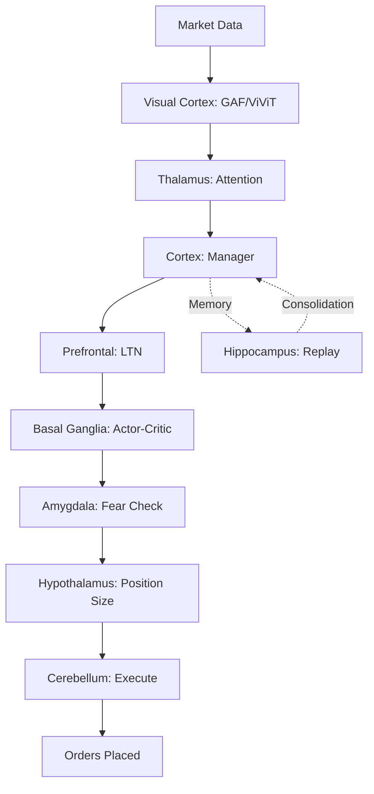

# JANUS Neuromorphic Implementation Guide

**Quick Start for Implementing Brain-Inspired Trading Architecture**

## Overview

This guide helps you implement the JANUS neuromorphic architecture, mapping brain regions to your Rust/Python trading system.

## 🚀 Quick Start

### 1. Generate the Structure

```bash
# Preview what will be created (dry run)
python create_neuromorphic_structure.py --dry-run

# Create the structure
python create_neuromorphic_structure.py --base-path src/janus/neuromorphic

# Review the generated structure
tree src/janus/neuromorphic
```

### 2. Add to Workspace

Edit `src/janus/Cargo.toml`:

```toml
[workspace]
members = [
    "crates/common",
    "crates/execution",
    "crates/logic",
    "crates/memory",
    "crates/proto",
    "crates/vision",
    "services/backward",
    "services/forward",
    "services/gateway",
    "services/monitor",
    "tests/integration",
    "tests/unit",
    "neuromorphic",  # Add this
]
```

### 3. Run Audit to Validate

```bash
# Run audit to check structure
python scripts/audit/main.py --static-audit --focus src/janus/neuromorphic

# Check categorization
python scripts/audit/main.py --stats-only
```

## 🧠 Brain Region Mapping

### Phase 1: Core Regions (Implement First)

#### 1. Visual Cortex (Pattern Recognition)
**Maps to:** Existing `janus-vision` crate

**Implementation:**
```bash
# Link existing GAF/ViViT code to visual_cortex
ln -s ../crates/vision src/janus/neuromorphic/visual_cortex/existing

# Or migrate gradually:
# 1. Copy gaf.rs to visual_cortex/gaf/
# 2. Update imports
# 3. Add to visual_cortex/mod.rs
```

**Key Files:**
- `visual_cortex/gaf/gasf.rs` - GAF encoding
- `visual_cortex/vivit/vivit_model.rs` - Transformer
- `visual_cortex/eyes/data_ingestion.rs` - Market data input

---

#### 2. Prefrontal Cortex (Logic & Compliance)
**Maps to:** Existing `janus-logic` crate

**Implementation:**
```rust
// prefrontal/ltn/predicates.rs
use crate::common::{Result, Error};

pub struct TradingPredicate {
    name: String,
    lukasiewicz: bool,
}

impl TradingPredicate {
    pub fn evaluate(&self, order: &Order) -> Result<f32> {
        // Lukasiewicz T-Norm: AND(a, b) = max(0, a + b - 1)
        // Returns compliance score [0.0, 1.0]
        Ok(0.8) // TODO: Implement
    }
}
```

**Key Files:**
- `prefrontal/ltn/fuzzy_logic.rs` - Lukasiewicz T-Norms
- `prefrontal/conscience/risk_limits.rs` - Risk enforcement
- `prefrontal/planning/goal_decomposition.rs` - Hierarchical planning

---

#### 3. Hippocampus (Memory & Replay)
**Maps to:** Existing `janus-memory` crate

**Implementation:**
```rust
// hippocampus/replay/sum_tree.rs
pub struct SumTree {
    capacity: usize,
    tree: Vec<f32>,
    data: Vec<Experience>,
}

impl SumTree {
    pub fn sample(&self, priority_sum: f32) -> Experience {
        // O(log N) sampling based on priorities
        todo!()
    }
}
```

**Key Files:**
- `hippocampus/replay/replay_buffer.rs` - PER implementation
- `hippocampus/swr/compressed_replay.rs` - Fast replay (backward service)
- `hippocampus/worker/worker_agent.rs` - Tactical policy (Feudal RL)

---

#### 4. Cerebellum (Execution)
**Maps to:** Existing `janus-execution` crate

**Implementation:**
```rust
// cerebellum/impact/almgren_chriss.rs
pub struct AlmgrenChriss {
    lambda: f32,  // Risk aversion
    eta: f32,     // Temporary impact
    gamma: f32,   // Permanent impact
}

impl AlmgrenChriss {
    pub fn optimal_trajectory(&self, total_shares: f32, time_horizon: f32) -> Vec<f32> {
        // Compute optimal execution schedule
        todo!()
    }
}
```

**Key Files:**
- `cerebellum/execution/order_router.rs` - Order routing
- `cerebellum/forward_models/smith_predictor.rs` - Latency compensation
- `cerebellum/error_correction/pid_controller.rs` - Execution feedback

---

### Phase 2: Advanced Regions

#### 5. Basal Ganglia (Action Selection)
**New Implementation** - Actor-Critic RL

```rust
// basal_ganglia/actor/policy_network.rs
pub struct PolicyNetwork {
    hidden_dim: usize,
    action_dim: usize,
}

impl PolicyNetwork {
    pub fn forward(&self, state: &State) -> ActionDistribution {
        // Neural network forward pass
        // Returns probability distribution over actions
        todo!()
    }
}

// basal_ganglia/critic/value_network.rs
pub struct ValueNetwork {
    hidden_dim: usize,
}

impl ValueNetwork {
    pub fn forward(&self, state: &State) -> f32 {
        // Estimate state value V(s)
        todo!()
    }
}

// basal_ganglia/praxeological/go_signal.rs
pub struct GoNoGoGate {
    threshold: f32,
}

impl GoNoGoGate {
    pub fn should_execute(&self, confidence: f32, ltn_score: f32) -> bool {
        // Combine RL confidence with LTN compliance
        // Go = Execute, No-Go = Inhibit
        confidence * ltn_score > self.threshold
    }
}
```

**Integration with Services:**
- Forward service uses for real-time action selection
- Backward service trains actor-critic networks

---

#### 6. Thalamus (Attention & Fusion)
**New Implementation** - Gated Cross-Attention

```rust
// thalamus/attention/cross_attention.rs
pub struct GatedCrossAttention {
    num_heads: usize,
    head_dim: usize,
}

impl GatedCrossAttention {
    pub fn forward(&self, query: &Tensor, key: &Tensor, value: &Tensor) -> Tensor {
        // Multi-head cross-attention
        // Gates irrelevant market signals
        todo!()
    }
}

// thalamus/fusion/price_fusion.rs
pub struct MultimodalFusion {
    price_encoder: Encoder,
    volume_encoder: Encoder,
    orderbook_encoder: Encoder,
}

impl MultimodalFusion {
    pub fn fuse(&self, price: &PriceData, volume: &VolumeData, orderbook: &OrderBook) -> Tensor {
        // Fuse multiple data modalities
        // Weighted by attention mechanism
        todo!()
    }
}
```

**Integration:**
- Forward service: Real-time attention to salient market signals
- Filters noise before cortex processing

---

#### 7. Amygdala (Fear & Safety)
**New Implementation** - Fear Network & Kill Switch

```rust
// amygdala/fear/fear_network.rs
pub struct FearNetwork {
    fear_memories: Vec<CrisisEvent>,
    threshold: f32,
}

impl FearNetwork {
    pub fn detect_threat(&self, market_state: &MarketState) -> ThreatLevel {
        // Check for conditions similar to past crises
        // Returns threat level: None, Low, Medium, High, Critical
        todo!()
    }
}

// amygdala/circuit_breakers/kill_switch.rs
pub struct KillSwitch {
    enabled: bool,
    threat_threshold: ThreatLevel,
}

impl KillSwitch {
    pub fn trigger(&mut self, threat: ThreatLevel) -> bool {
        if threat >= self.threat_threshold {
            // EMERGENCY: Cancel all orders, close positions
            // Override ALL other processing
            self.emergency_shutdown();
            true
        } else {
            false
        }
    }
}

// amygdala/vpin/vpin_calculator.rs
pub struct VPINCalculator {
    bucket_size: usize,
}

impl VPINCalculator {
    pub fn calculate(&self, trades: &[Trade]) -> f32 {
        // Volume-Synchronized Probability of Informed Trading
        // High VPIN = Toxic order flow = Danger
        todo!()
    }
}
```

**Critical Feature:** Amygdala can OVERRIDE all other regions in danger!

---

#### 8. Hypothalamus (Homeostasis & Risk)
**New Implementation** - Risk Appetite & Position Sizing

```rust
// hypothalamus/homeostasis/balance_tracker.rs
pub struct BalanceTracker {
    target_allocation: HashMap<Asset, f32>,
    current_allocation: HashMap<Asset, f32>,
    tolerance: f32,
}

impl BalanceTracker {
    pub fn deviation(&self) -> f32 {
        // Calculate deviation from target allocation
        // Triggers rebalancing when exceeded
        todo!()
    }
}

// hypothalamus/position_sizing/kelly_criterion.rs
pub struct KellyCriterion {
    win_rate: f32,
    avg_win: f32,
    avg_loss: f32,
}

impl KellyCriterion {
    pub fn optimal_fraction(&self) -> f32 {
        // f* = (p * b - q) / b
        // where p = win_rate, q = 1-p, b = avg_win/avg_loss
        let p = self.win_rate;
        let q = 1.0 - p;
        let b = self.avg_win / self.avg_loss;
        (p * b - q) / b
    }
}

// hypothalamus/risk_appetite/fear_greed_index.rs
pub struct RiskAppetite {
    current_drawdown: f32,
    recent_pnl: Vec<f32>,
}

impl RiskAppetite {
    pub fn appetite_multiplier(&self) -> f32 {
        // Reduce risk during drawdown (fear)
        // Increase risk during profit (greed, but capped)
        if self.current_drawdown > 0.1 {
            0.5  // Fear: cut position size by 50%
        } else if self.recent_pnl.iter().all(|&p| p > 0.0) {
            1.2  // Greed: increase by 20% (capped to prevent overconfidence)
        } else {
            1.0  // Normal
        }
    }
}
```

**Integration:**
- Dynamically adjusts position sizes based on portfolio state
- Maintains "homeostasis" (target allocation)

---

### Phase 3: System Integration

#### 9. Cortex (Manager Agent)
**New Implementation** - Strategic Policy (Feudal RL)

```rust
// cortex/manager/strategic_policy.rs
pub struct ManagerAgent {
    subgoals: Vec<SubGoal>,
    worker: WorkerAgent,  // Links to Hippocampus
}

impl ManagerAgent {
    pub fn set_goal(&mut self, goal: Goal) {
        // Decompose high-level goal into subgoals
        // Example: "Maximize Sharpe ratio" -> 
        //   1. Identify high-probability setups
        //   2. Size positions optimally
        //   3. Manage risk dynamically
        self.subgoals = self.decompose(goal);
    }

    pub fn delegate(&mut self, subgoal: SubGoal) -> WorkerAction {
        // Delegate subgoal to worker
        self.worker.execute(subgoal)
    }
}
```

**Feudal RL Architecture:**
- **Manager** (Cortex): Sets subgoals for worker, slow timescale (minutes/hours)
- **Worker** (Hippocampus): Executes tactics to achieve subgoals, fast timescale (seconds)

---

#### 10. Integration (Orchestration)
**Ties Everything Together**

```rust
// integration/engine/orchestrator.rs
pub struct NeuromorphicOrchestrator {
    // Brain regions
    visual_cortex: VisualCortex,
    thalamus: Thalamus,
    cortex: Cortex,
    hippocampus: Hippocampus,
    basal_ganglia: BasalGanglia,
    prefrontal: Prefrontal,
    amygdala: Amygdala,
    hypothalamus: Hypothalamus,
    cerebellum: Cerebellum,
}

impl NeuromorphicOrchestrator {
    pub async fn process_tick(&mut self, tick: MarketTick) -> Result<Action> {
        // 1. Visual Cortex: Encode as GAF
        let visual_features = self.visual_cortex.encode(&tick)?;

        // 2. Thalamus: Attention & fusion
        let attended_features = self.thalamus.attend(&visual_features)?;

        // 3. Cortex: Strategic assessment
        let strategic_assessment = self.cortex.assess(&attended_features)?;

        // 4. Prefrontal: Logic validation (LTN)
        let ltn_score = self.prefrontal.validate(&strategic_assessment)?;

        // 5. Hippocampus: Retrieve similar experiences
        let similar_experiences = self.hippocampus.recall(&attended_features)?;

        // 6. Basal Ganglia: Action selection (Actor-Critic)
        let action = self.basal_ganglia.select_action(&strategic_assessment)?;

        // 7. Amygdala: Threat check (OVERRIDE if danger)
        if self.amygdala.detect_threat(&tick)? {
            return Ok(Action::EmergencyShutdown);
        }

        // 8. Hypothalamus: Position sizing
        let position_size = self.hypothalamus.size_position(&action)?;

        // 9. Prefrontal: Final compliance check
        if ltn_score < 0.5 {
            return Ok(Action::NoGo);  // Compliance too low
        }

        // 10. Cerebellum: Execute with optimal trajectory
        let execution_plan = self.cerebellum.plan_execution(&action, position_size)?;

        // 11. Store experience in Hippocampus
        self.hippocampus.store(Experience {
            state: attended_features,
            action: action.clone(),
            reward: 0.0,  // Updated later
            next_state: None,  // Updated next tick
        })?;

        Ok(Action::Execute(execution_plan))
    }

    pub async fn consolidate_memory(&mut self) -> Result<()> {
        // Sleep state: Hippocampus → Cortex consolidation
        let experiences = self.hippocampus.sample_replay()?;
        self.cortex.consolidate(experiences)?;
        Ok(())
    }
}
```

---

## 🔄 Wake-Sleep Cycle Implementation

### Wake State (Forward Service)

```rust
// In janus-forward/src/main.rs
use janus_neuromorphic::integration::Orchestrator;

#[tokio::main]
async fn main() -> Result<()> {
    let mut orchestrator = Orchestrator::new()?;

    // Real-time processing loop
    loop {
        let tick = market_data_stream.recv().await?;
        
        // Process through all brain regions
        let action = orchestrator.process_tick(tick).await?;
        
        match action {
            Action::Execute(plan) => {
                execution_engine.execute(plan).await?;
            }
            Action::NoGo => {
                // LTN blocked the trade
                log::warn!("Trade blocked by compliance check");
            }
            Action::EmergencyShutdown => {
                // Amygdala override!
                panic!("Emergency shutdown triggered by threat detection");
            }
        }
    }
}
```

### Sleep State (Backward Service)

```rust
// In janus-backward/src/main.rs
use janus_neuromorphic::hippocampus::swr::CompressedReplay;

async fn consolidation_task(orchestrator: &mut Orchestrator) {
    // Run periodically (e.g., every hour, overnight)
    loop {
        tokio::time::sleep(Duration::from_secs(3600)).await;

        log::info!("Starting memory consolidation (sleep state)");

        // Sharp Wave Ripple simulation: Compressed replay
        orchestrator.consolidate_memory().await.unwrap();

        log::info!("Memory consolidation complete");
    }
}
```

---

## 🎯 Migration Strategy

### Option 1: Gradual Migration (Recommended)

1. **Keep existing crates** (`janus-vision`, `janus-logic`, etc.)
2. **Create neuromorphic structure** as new organization
3. **Link/re-export** from neuromorphic to existing crates
4. **New code** goes in neuromorphic structure
5. **Eventually deprecate** old structure

**Example:**
```rust
// src/janus/neuromorphic/visual_cortex/mod.rs
pub use janus_vision::gaf::{GASF, GADF};  // Re-export existing
pub mod eyes;  // New code
```

### Option 2: Fresh Start

1. **Create neuromorphic structure** from scratch
2. **Implement all regions** using templates
3. **Migrate logic** from old crates gradually
4. **Update services** to use neuromorphic imports

---

## 🔍 Audit Integration

### Update Audit Categories

The audit system now recognizes neuromorphic regions:

```python
# In scripts/audit/main.py (already updated)
if "cortex/" in path_lower:
    return "CORTEX"
if "hippocampus/" in path_lower:
    return "HIPPOCAMPUS"
# ... etc for all regions
```

### Run Audit on Neuromorphic Code

```bash
# Check categorization
python scripts/audit/main.py --stats-only

# Static analysis on specific region
python scripts/audit/main.py --static-audit --focus src/janus/neuromorphic/amygdala

# Full audit
python scripts/audit/main.py
```

### Expected Audit Output

```
CORTEX: 15 files (Manager agent, strategic planning)
HIPPOCAMPUS: 20 files (Worker agent, PER, episodic memory)
BASAL_GANGLIA: 16 files (Actor-Critic, action selection)
THALAMUS: 12 files (Attention, fusion)
PREFRONTAL: 14 files (LTN, compliance)
AMYGDALA: 10 files (Fear network, kill switch)
HYPOTHALAMUS: 12 files (Homeostasis, position sizing)
CEREBELLUM: 16 files (Execution, error correction)
VISUAL_CORTEX: 14 files (GAF, ViViT)
INTEGRATION: 8 files (Orchestration, workflows)
```

---

## 📚 Testing

### Unit Tests (Per Region)

```rust
// cerebellum/execution/tests/test_execution.rs
#[test]
fn test_order_routing() {
    let router = OrderRouter::new();
    let order = Order { /* ... */ };
    assert!(router.route(&order).is_ok());
}
```

### Integration Tests (Between Regions)

```rust
// tests/integration/test_neuromorphic.rs
#[tokio::test]
async fn test_cortex_hippocampus_flow() {
    let cortex = Cortex::new();
    let hippocampus = Hippocampus::new();

    // Manager sets goal
    cortex.set_goal(Goal::MaximizeSharpe);

    // Worker executes
    let action = hippocampus.execute_subgoal(cortex.current_subgoal());
    
    assert!(action.is_ok());
}
```

### System Tests (Whole Brain)

```rust
#[tokio::test]
async fn test_full_wake_sleep_cycle() {
    let mut orchestrator = Orchestrator::new();

    // Wake: Process ticks
    for tick in test_ticks() {
        let action = orchestrator.process_tick(tick).await.unwrap();
        // Store action results
    }

    // Sleep: Consolidate
    orchestrator.consolidate_memory().await.unwrap();

    // Verify learning occurred
    assert!(orchestrator.cortex.has_learned());
}
```

---

## 🎨 Visualization

### Mermaid Diagram (Auto-generated by Audit)



---

## 🚨 Common Pitfalls

### 1. **Region Contamination**
❌ **Bad:** Execution logic in Visual Cortex
```rust
// visual_cortex/gaf/encoding.rs - WRONG!
fn encode_and_execute(tick: Tick) {
    let gaf = encode(tick);
    place_order(gaf);  // ❌ Execution doesn't belong here
}
```

✅ **Good:** Separation of concerns
```rust
// visual_cortex/gaf/encoding.rs - CORRECT
fn encode(tick: Tick) -> GAFImage {
    // Only encoding
}

// cerebellum/execution/order_router.rs - CORRECT
fn execute(gaf: GAFImage) {
    // Only execution
}
```

### 2. **Ignoring Amygdala Override**
❌ **Bad:** Amygdala can be ignored
```rust
let threat = amygdala.detect_threat();
if let Some(t) = threat {
    log::warn!("Threat detected: {}", t);
    // Continue anyway ❌
}
```

✅ **Good:** Amygdala MUST override
```rust
if amygdala.detect_threat()? {
    // EMERGENCY: Override everything
    return Err(Error::EmergencyShutdown);
}
```

### 3. **Forgetting Consolidation**
❌ **Bad:** No sleep state
```rust
// Only wake state, never consolidate
loop {
    process_tick();
}
```

✅ **Good:** Wake-sleep cycle
```rust
tokio::spawn(async move {
    loop {
        sleep(Duration::from_secs(3600)).await;
        consolidate_memory().await;
    }
});
```

---

## 📖 References

1. **Neuroscience:**
   - Felleman & Van Essen (1991) - "Distributed hierarchical processing in primate cerebral cortex"
   - Wilson & McNaughton (1994) - "Reactivation of hippocampal ensemble memories during sleep"
   - Doya (2000) - "Complementary roles of basal ganglia and cerebellum"

2. **Machine Learning:**
   - Vezhnevets et al. (2017) - "FeUdal Networks for Hierarchical RL"
   - Schaul et al. (2016) - "Prioritized Experience Replay"
   - Serafini & Garcez (2016) - "Logic Tensor Networks"

3. **Trading:**
   - Almgren & Chriss (2000) - "Optimal execution of portfolio transactions"
   - Easley et al. (2012) - "Flow toxicity and liquidity in a high-frequency world"

---

## ✅ Checklist

- [ ] Generate neuromorphic structure
- [ ] Add to workspace Cargo.toml
- [ ] Implement Visual Cortex (link janus-vision)
- [ ] Implement Prefrontal (link janus-logic)
- [ ] Implement Hippocampus (link janus-memory)
- [ ] Implement Cerebellum (link janus-execution)
- [ ] Implement Basal Ganglia (new)
- [ ] Implement Thalamus (new)
- [ ] Implement Amygdala (new)
- [ ] Implement Hypothalamus (new)
- [ ] Implement Cortex (enhance)
- [ ] Implement Integration (orchestrator)
- [ ] Update Forward service to use orchestrator
- [ ] Update Backward service for consolidation
- [ ] Run audit: `python scripts/audit/main.py`
- [ ] Write tests for each region
- [ ] Document neuromorphic principles
- [ ] Train team on brain-inspired architecture

---

**Last Updated:** 2025-01-XX  
**Status:** 🟢 Ready for Implementation  
**Next Review:** After Phase 1 complete