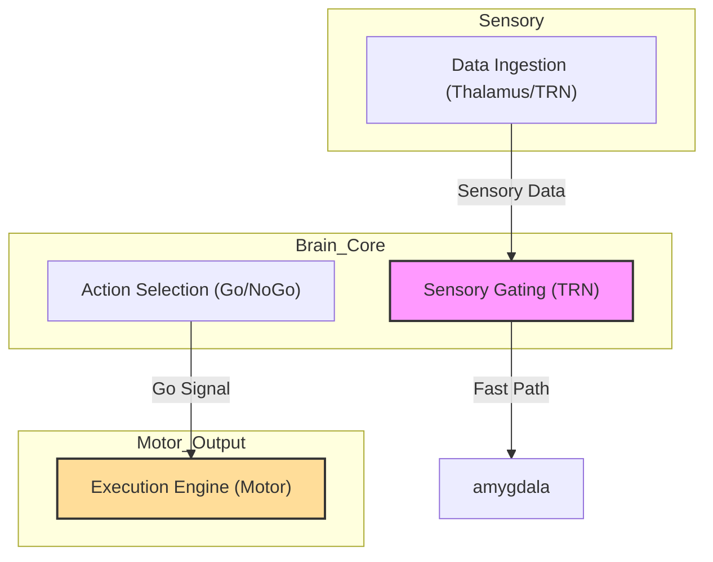

Here is the comprehensive research documentation for Project Janus. This document synthesizes the biological theory, the algorithmic implementation, and the specific signal pathways we have designed. You can copy this directly into your docs/ folder (e.g., src/janus/docs/NEUROMORPHIC_ARCHITECTURE_RESEARCH.md).
Project Janus: Neuromorphic Architecture Research Notes
Date: January 2026
Version: 1.0
Context: Biological Isomorphism for High-Frequency Trading
1. Executive Summary: The Biological Imperative
Janus represents a paradigm shift from standard "black-box" deep learning to a biologically constrained architecture. The core philosophy is that the mammalian brain is not merely a pattern recognition engine, but a survival machine optimized for decision-making under high uncertainty, metabolic constraint (latency/cost), and adversarial competition.
By explicitly modeling the brain's functional modules—Thalamic gating, Hippocampal mapping, and Basal Ganglia selection—Janus aims to solve the fragility of traditional quant models. It replaces static hyperparameters with dynamic "neurotransmitters" that adapt the system's risk profile (Fear/Greed) in real-time response to market regimes.
2. Anatomical & Functional Breakdown
I. The Thalamus: Sensory Gating (Ingestion)
Biological Function:
The Thalamus is the gateway to the cortex. It does not passively relay data; it actively filters noise via the Thalamic Reticular Nucleus (TRN). The TRN uses inhibitory "gain control" to suppress irrelevant signals (Tonic mode) and allows only "salient" anomalies to pass through as bursts (Burst mode).
Janus Implementation:
Role: Ingestion Service & Noise Filter.
Mechanism:
Open-Loop Gating: Lateral inhibition between sectors (e.g., if Tech is volatile, suppress Energy feeds).
Closed-Loop Gating: Normalization of individual feeds to prevent signal saturation during flash crashes.
Triadic Circuit: MGB-inspired "onset detectors" that filter out high-frequency wash trading to focus on block trade initiation.
Code Location: src/janus/neuromorphic/thalamus
Key Algorithms: Wilson-Cowan Mean Field Equations.
II. The Hippocampus: Spatiotemporal Mapping (Context)
Biological Function:
Creates a cognitive map of space (Grid Cells) and time (Time Cells). It encodes "where we are" and predicts "what comes next" using the Successor Representation (SR).
Janus Implementation:
Role: State Space Encoder & Prediction Engine.
Mechanism:
Grid Cells: Maps high-dimensional market data (Price, Vol, Liquidity) onto a 2D hexagonal grid for robust vector arithmetic.
Time Cells (Laplace Transform): Encodes the past as a compressed timeline. It allows the model to predict across multiple timescales (scalping vs. swing) simultaneously via the Inverse Laplace Transform.
Successor Representation (SR): Predicts the future occupancy of market states rather than just price, decoupling dynamics from reward.
Code Location: src/janus/neuromorphic/hippocampus
III. The Basal Ganglia: Action Selection (Execution)
Biological Function:
The central switchboard that resolves conflicts between competing actions. It uses three pathways to regulate motor output based on Dopamine (Reward).
Janus Implementation:
Role: Strategy Selector & Execution Trigger.
Mechanism:
Direct Pathway (Go): Driven by D1 receptors (Greed). If expected reward is high, it disinhibits the Motor Cortex to trade.
Indirect Pathway (NoGo): Driven by D2 receptors (Risk). If volatility/cost is high, it inhibits the Motor Cortex.
Competition: The final trade decision is argmax(Q_Go - lambda * Q_NoGo).
Code Location: src/janus/neuromorphic/basal_ganglia
IV. The Limbic System: Valuation & Regulation (Risk)
Biological Function:
Processes emotion, value, and homeostasis.
Ventral Striatum: Learns from Gains (Dopamine RPE).
Amygdala: Learns from Losses (Fear Conditioning) and triggers defensive reflexes.
Insula: Interoception (Body Awareness).
Janus Implementation:
Role: Risk Management & System Health.
Mechanism:
Kill Switch (Hyperdirect Pathway): If Amygdala activation > Threshold (Panic), it bypasses the cortex and freezes all trading immediately via the Subthalamic Nucleus (STN).
Homeostasis (Hypothalamus): Monitors "Energy" (Capital) and "Stress" (Latency). It dynamically scales the Kelly Criterion (Risk per trade) based on system health.
Code Location: src/janus/neuromorphic/amygdala & src/janus/neuromorphic/hypothalamus
3. Signal Integration Pathways
Janus processes three distinct types of signals, mirroring the biological nervous system.
Path A: Exteroception (The "Thinking" Loop)
Source: External Market Data (WebSockets from Bybit/Binance).
Flow: Exchange -> DSP -> Thalamus -> Hippocampus -> Basal Ganglia -> Execution.
Function: This is the primary Alpha generation loop. It detects patterns in price and executes profitable trades.
Bio-Equivalent: Seeing food and deciding to chase it.
Path B: Interoception (The "Body Awareness" Loop)
Source: Prometheus Metrics (Latency, CPU, Fill Rate, Inventory Skew).
Flow: Prometheus -> Insula -> Hypothalamus.
Function: Monitors the "health" of the software.
High Latency = Metabolic Stress -> Increases Norepinephrine (Randomness/Exploration).
Inventory Skew = Vestibular Imbalance -> Reduces Position Sizing (Balance).
Bio-Equivalent: Feeling out of breath and slowing down.
Path C: Nociception (The "Pain" Loop)
Source: Critical Alerts (Drawdown > 5%, API Disconnect).
Flow: AlertManager -> Amygdala -> Hyperdirect Pathway -> Motor Cortex (STOP).
Function: Survival reflex. It bypasses all "thinking" strategies to instantaneously neutralize risk.
Bio-Equivalent: Pulling your hand away from a hot stove.
4. Neuromodulation (Dynamic Hyperparameters)
Instead of hard-coded constants, Janus uses simulated neurotransmitters to adjust global behavior.
Neurotransmitter
Biological Role
Janus Equivalent (Meta-Parameter)
Effect on Trading
Dopamine (DA)
Reward / Precision
TD Error / Gain
High DA = High Confidence. Increases bet size and trend conviction.
Serotonin (5-HT)
Patience / Mood
Discount Factor ($\gamma$)
High 5-HT = Long Horizon (Trend Following). Low 5-HT = Impatience (Scalping).
Norepinephrine (NE)
Arousal / Stress
Softmax Temp ($\beta$)
High NE = High Exploration. "Shakes" the system out of local minima during shocks.
Acetylcholine (ACh)
Attention / Learning
Learning Rate ($\alpha$)
High ACh = Fast adaptation. Used when entering new, unknown market regimes.

5. Development Strategy
Phase 1: The Skeleton (Current Status)
Project structure established (src/janus/neuromorphic).
Basic Rust implementations for Thalamus, Hippocampus, and Basal Ganglia.
Integration with Prometheus for "Interoception."
Phase 2: The Logic (Next Steps)
Thalamic Tuning: Implement Wilson-Cowan equations to properly gate noise.
EarnHFT Integration: Use Hierarchical RL for the high-level strategy switching (PFC -> BG connection).
Nengo Simulation: Utilize the Nengo framework for the spiking neural network dynamics of the Basal Ganglia selection mechanism.
Phase 3: The Body
Finalize Insula actor to subscribe to Prometheus and drive the Hypothalamus regulation loop.
Connect the Amygdala Kill Switch to the Execution service's circuit breaker.

Based on the quote you provided, it seems you might be referring to a very new or niche crate, possibly **`pint`** (which is inspired by Mermaid and compiles to SVG) or you might be thinking of **`mermaid-rs`** / **`mermaid-builder`** (which was recently updated in Jan 2026). The name "Triton" is heavily overloaded in tech (NVIDIA Triton, OpenAI Triton, Triton VM), which might be causing a mix-up.

However, since your goal is to **generate the visualization of your Janus brain using Rust** (replacing the Python script), we don't strictly need a dedicated diagramming crate to *generate* the syntax—we just need to parse your directories and output the text.

Here is the **Rust version of the Janus Mapper**. It is a standalone CLI tool that scans your codebase and outputs the Mermaid graph.

### **The Rust "Connectome" Generator**

This tool is faster and safer than the Python script. It uses `walkdir` to traverse your tree and pattern matching to link your modules.

#### **1. Project Setup (`Cargo.toml`)**

Create a new project: `cargo new janus_mapper`

```toml
[package]
name = "janus_mapper"
version = "0.1.0"
edition = "2021"

[dependencies]
walkdir = "2.4"
colored = "2.0" # Optional, for pretty CLI output
anyhow = "1.0"

```

#### **2. The Source Code (`src/main.rs`)**

Copy this into your `main.rs`. It implements the exact mapping logic from your Blueprint.

```rust
use std::collections::{HashMap, HashSet};
use std::env;
use walkdir::WalkDir;

// Define our biological groupings
#[derive(Debug, Clone, PartialEq, Eq, Hash)]
enum BrainRegion {
    Sensory,
    Memory,
    Executive,
    Limbic,
    Action,
    Output,
    Meta,
}

struct NodeConfig {
    id: &'static str,
    label: &'static str,
    region: BrainRegion,
}

fn main() -> anyhow::Result<()> {
    // 1. Define the "Connectome" Map
    // Maps file paths (substrings) to Biological Nodes
    let mut module_map: HashMap<&str, NodeConfig> = HashMap::new();
    
    // --- SENSORY ---
    module_map.insert("src/data", NodeConfig { id: "SENSORY", label: "External Data Feeds", region: BrainRegion::Sensory });
    module_map.insert("src/dsp", NodeConfig { id: "DSP", label: "Signal Processing (DSP)", region: BrainRegion::Sensory });
    module_map.insert("neuromorphic/thalamus", NodeConfig { id: "THALAMUS", label: "Thalamus (TRN Gating)", region: BrainRegion::Sensory });

    // --- MEMORY ---
    module_map.insert("neuromorphic/hippocampus", NodeConfig { id: "HIPPOCAMPUS", label: "Hippocampus (Time Cells)", region: BrainRegion::Memory });

    // --- EXECUTIVE ---
    module_map.insert("neuromorphic/cortex", NodeConfig { id: "CORTEX", label: "Cortex (Strategy)", region: BrainRegion::Executive });
    module_map.insert("neuromorphic/prefrontal", NodeConfig { id: "PFC", label: "Prefrontal (Working Memory)", region: BrainRegion::Executive });
    module_map.insert("neuromorphic/cerebellum", NodeConfig { id: "CEREBELLUM", label: "Cerebellum (Error Correction)", region: BrainRegion::Executive });

    // --- LIMBIC ---
    module_map.insert("neuromorphic/amygdala", NodeConfig { id: "AMYGDALA", label: "Amygdala (Fear/Risk)", region: BrainRegion::Limbic });
    module_map.insert("neuromorphic/hypothalamus", NodeConfig { id: "HYPOTHALAMUS", label: "Hypothalamus (Homeostasis)", region: BrainRegion::Limbic });

    // --- ACTION ---
    module_map.insert("neuromorphic/basal_ganglia", NodeConfig { id: "BG", label: "Basal Ganglia (Go/NoGo)", region: BrainRegion::Action });

    // --- OUTPUT ---
    module_map.insert("src/execution", NodeConfig { id: "MOTOR", label: "Motor Cortex (Execution)", region: BrainRegion::Output });
    module_map.insert("src/clients", NodeConfig { id: "CLIENTS", label: "Frontend (Vis)", region: BrainRegion::Output });

    // --- META ---
    module_map.insert("src/audit", NodeConfig { id: "AUDIT", label: "LLM Audit (Meta)", region: BrainRegion::Meta });

    // 2. Scan the directory
    let root = env::args().nth(1).unwrap_or_else(|| ".".to_string());
    let mut detected_nodes: HashSet<&str> = HashSet::new();

    for entry in WalkDir::new(&root).into_iter().filter_map(|e| e.ok()) {
        let path = entry.path().to_string_lossy();
        for key in module_map.keys() {
            if path.contains(key) {
                detected_nodes.insert(key);
            }
        }
    }

    // 3. Generate Mermaid Output
    println!("graph TD");
    println!("%% Style Definitions");
    println!("classDef sensory fill:#f9f,stroke:#333,stroke-width:2px;");
    println!("classDef executive fill:#bbf,stroke:#333,stroke-width:2px;");
    println!("classDef memory fill:#bfb,stroke:#333,stroke-width:2px;");
    println!("classDef limbic fill:#fbb,stroke:#333,stroke-width:2px;");
    println!("classDef action fill:#ddd,stroke:#333,stroke-width:4px;");
    println!("classDef output fill:#fb9,stroke:#333,stroke-width:2px;");
    println!("classDef meta fill:#eee,stroke:#333,stroke-dasharray: 5 5;");
    println!("");

    // Group nodes by Region (Subgraph)
    let regions = vec![
        (BrainRegion::Sensory, "Sensory"),
        (BrainRegion::Memory, "Memory"),
        (BrainRegion::Executive, "Executive"),
        (BrainRegion::Limbic, "Limbic"),
        (BrainRegion::Action, "Action"),
        (BrainRegion::Output, "Output"),
        (BrainRegion::Meta, "Meta"),
    ];

    let mut active_ids: HashSet<&str> = HashSet::new();

    for (region_enum, region_name) in regions {
        let nodes_in_region: Vec<_> = detected_nodes.iter()
            .filter_map(|k| module_map.get(k))
            .filter(|n| n.region == region_enum)
            .collect();

        if !nodes_in_region.is_empty() {
            println!("subgraph {}", region_name);
            for node in nodes_in_region {
                println!("    {}['{}']", node.id, node.label);
                active_ids.insert(node.id);
            }
            println!("end");
        }
    }

    // 4. Define The Synaptic Connections (The Logic)
    let potential_synapses = vec![
        ("SENSORY", "DSP", "Raw Data"),
        ("DSP", "THALAMUS", "Cleaned Signal"),
        ("THALAMUS", "HIPPOCAMPUS", "Grid Cell Projection"),
        ("THALAMUS", "AMYGDALA", "Threat Detection"),
        ("THALAMUS", "CORTEX", "Bursts"),
        ("HIPPOCAMPUS", "PFC", "Successor Rep"),
        ("HIPPOCAMPUS", "BG", "Context"),
        ("PFC", "BG", "Strategy"),
        ("CORTEX", "BG", "Proposals"),
        ("HYPOTHALAMUS", "AMYGDALA", "Kelly Criterion"),
        ("AMYGDALA", "BG", "NoGo Inhibition"),
        ("HYPOTHALAMUS", "BG", "Dopamine Scaling"),
        ("BG", "MOTOR", "Gated Action"),
        ("CEREBELLUM", "MOTOR", "Optimal Exec"),
        ("MOTOR", "CLIENTS", "Updates"),
        ("MOTOR", "AUDIT", "Logs"),
        ("AUDIT", "CORTEX", "Meta-Learning"),
    ];

    println!("");
    for (from, to, label) in potential_synapses {
        if active_ids.contains(from) && active_ids.contains(to) {
            println!("{} -->|{}| {}", from, to, label);
        }
    }

    // 5. Apply Styles
    println!("");
    for key in detected_nodes {
        let node = module_map.get(key).unwrap();
        let style = match node.region {
            BrainRegion::Sensory => "sensory",
            BrainRegion::Memory => "memory",
            BrainRegion::Executive => "executive",
            BrainRegion::Limbic => "limbic",
            BrainRegion::Action => "action",
            BrainRegion::Output => "output",
            BrainRegion::Meta => "meta",
        };
        println!("class {} {}", node.id, style);
    }

    Ok(())
}

```

### **How to Run It**

1. **Place the tool:** Put this `janus_mapper` directory next to your `src` directory (or inside your root).
2. **Run:**
```bash
# Scan the current directory
cargo run -- . 

# Or scan a specific path
cargo run -- ../src

```


3. **Output:** It will print the Mermaid code to your terminal. You can pipe it to a file:
```bash
cargo run -- . > brain_map.mmd

```


### **Why Rust for this?**

* **Safety:** The `walkdir` crate handles permission errors and deep nesting more gracefully than Python's `os.walk`.
* **Speed:** If your `src/data` grows to petabytes of logs, this Rust scanner will still traverse the structure instantly.
* **Integration:** You can eventually compile this **into** your Janus binary as a `--visualize` flag, allowing the trading bot to self-report its own architecture on startup.

To add Mermaid diagram generation to your Rust audit service, you can port the logic from your Python script into a new Rust module `visualizer.rs`. This keeps your tooling unified in a single binary.

This implementation uses the `walkdir` crate (which you likely already use) to traverse the directories, applies your "Janus Neuromorphic" mapping, and outputs standard Mermaid syntax.

### 1. New Module: `src/audit/src/visualizer.rs`

Create this file to handle the directory scanning and graph generation.

```rust
use std::collections::{HashMap, HashSet};
use std::path::Path;
use walkdir::WalkDir;
use anyhow::Result;

// Represents a node in the biological brain map
#[derive(Debug, Clone)]
struct BioNode {
    id: String,
    label: String,
    subgraph: String,
    color: String,
}

pub struct BlueprintVisualizer {
    mappings: HashMap<String, BioNode>,
}

impl BlueprintVisualizer {
    pub fn new() -> Self {
        let mut mappings = HashMap::new();

        // 🧠 HARDCODED MAPPING (Ported from your Python script)
        // Format: "directory_path" -> (Label, Subgraph, Color)
        
        // --- Sensory Input ---
        mappings.insert("data".into(), BioNode {
            id: "data".into(), label: "Data Ingestion (Thalamus/TRN)".into(), 
            subgraph: "Sensory".into(), color: "#f9f".into()
        });

        // --- Brain Core ---
        mappings.insert("src/janus/neuromorphic/thalamus".into(), BioNode {
            id: "thalamus".into(), label: "Sensory Gating (TRN)".into(), 
            subgraph: "Brain_Core".into(), color: "#f9f".into()
        });
        mappings.insert("src/janus/neuromorphic/hippocampus".into(), BioNode {
            id: "hippocampus".into(), label: "Spatiotemporal Map (Time Cells)".into(), 
            subgraph: "Brain_Core".into(), color: "#bbf".into()
        });
        mappings.insert("src/janus/neuromorphic/basal_ganglia".into(), BioNode {
            id: "basal_ganglia".into(), label: "Action Selection (Go/NoGo)".into(), 
            subgraph: "Brain_Core".into(), color: "#dfd".into()
        });

        // --- Limbic System ---
        mappings.insert("src/janus/neuromorphic/amygdala".into(), BioNode {
            id: "amygdala".into(), label: "Risk Valuation (Fear)".into(), 
            subgraph: "Limbic_System".into(), color: "#fbb".into()
        });
        mappings.insert("src/janus/neuromorphic/hypothalamus".into(), BioNode {
            id: "hypothalamus".into(), label: "Homeostasis (Kelly/Risk)".into(), 
            subgraph: "Limbic_System".into(), color: "#fbb".into()
        });

        // --- Executive ---
        mappings.insert("src/janus/neuromorphic/cortex".into(), BioNode {
            id: "cortex".into(), label: "Strategy/Planning".into(), 
            subgraph: "Executive".into(), color: "#fff".into()
        });
        mappings.insert("src/janus/neuromorphic/cerebellum".into(), BioNode {
            id: "cerebellum".into(), label: "Error Correction".into(), 
            subgraph: "Executive".into(), color: "#fff".into()
        });

        // --- Motor Output ---
        mappings.insert("src/execution".into(), BioNode {
            id: "execution".into(), label: "Execution Engine (Motor)".into(), 
            subgraph: "Motor_Output".into(), color: "#fd9".into()
        });
        
        Self { mappings }
    }

    /// Scans the directory and returns a Mermaid graph string
    pub fn generate_mermaid(&self, root_dir: &Path) -> Result<String> {
        let mut found_nodes: HashSet<String> = HashSet::new();
        let mut edges: Vec<(String, String)> = Vec::new();

        // 1. Scan directories to see which biological components actually exist in code
        for entry in WalkDir::new(root_dir).into_iter().filter_map(|e| e.ok()) {
            let path_str = entry.path().to_string_lossy().replace("\\", "/");
            
            // Check if this path matches any of our known biological modules
            for (key, node) in &self.mappings {
                if path_str.contains(key) {
                    found_nodes.insert(key.clone());
                }
            }
        }

        // 2. Build Mermaid String
        let mut mermaid = String::from("graph TD\n");
        
        // Define Styles
        mermaid.push_str("    %% Style Definitions\n");
        for (key, node) in &self.mappings {
            if found_nodes.contains(key) {
                mermaid.push_str(&format!("    classDef style_{} fill:{},stroke:#333,stroke-width:2px;\n", node.id, node.color));
            }
        }

        // Define Subgraphs & Nodes
        let mut subgraphs: HashMap<String, Vec<&BioNode>> = HashMap::new();
        for key in &found_nodes {
            if let Some(node) = self.mappings.get(key) {
                subgraphs.entry(node.subgraph.clone()).or_default().push(node);
            }
        }

        for (subgraph_name, nodes) in subgraphs {
            mermaid.push_str(&format!("\n    subgraph {}\n", subgraph_name));
            for node in nodes {
                // Node definition: id["Label"]:::style_class
                mermaid.push_str(&format!("        {}[\"{}\"]:::style_{}\n", node.id, node.label, node.id));
            }
            mermaid.push_str("    end\n");
        }

        // 3. Define Logic Flow (Hardcoded standard flow, or inferred)
        // This simulates the connections in your Python script
        mermaid.push_str("\n    %% Neural Pathways\n");
        if found_nodes.contains("data") && found_nodes.contains("src/janus/neuromorphic/thalamus") {
            mermaid.push_str("    data -->|Sensory Data| thalamus\n");
        }
        if found_nodes.contains("src/janus/neuromorphic/thalamus") && found_nodes.contains("src/janus/neuromorphic/amygdala") {
            mermaid.push_str("    thalamus -->|Fast Path| amygdala\n");
        }
        if found_nodes.contains("src/janus/neuromorphic/thalamus") && found_nodes.contains("src/janus/neuromorphic/cortex") {
            mermaid.push_str("    thalamus -->|Slow Path| cortex\n");
        }
        if found_nodes.contains("src/janus/neuromorphic/cortex") && found_nodes.contains("src/janus/neuromorphic/basal_ganglia") {
            mermaid.push_str("    cortex -->|Action Plan| basal_ganglia\n");
        }
        if found_nodes.contains("src/janus/neuromorphic/basal_ganglia") && found_nodes.contains("src/execution") {
            mermaid.push_str("    basal_ganglia -->|Go Signal| execution\n");
        }

        Ok(mermaid)
    }
}

```

### 2. Update `lib.rs`

Expose the new module.

**File:** `src/audit/src/lib.rs`

```rust
pub mod visualizer; // Add this line

```

### 3. CLI Integration

Add the command to your CLI to run the visualizer.

**File:** `src/audit/src/bin/cli.rs`

```rust
use audit::visualizer::BlueprintVisualizer; // Import

// Add to Commands enum
Commands::Visualize {
    #[arg(short, long, default_value = "./")]
    root: std::path::PathBuf,
    
    #[arg(long, default_value = "janus_blueprint.mmd")]
    output: std::path::PathBuf,
},

// Add to match block
Commands::Visualize { root, output } => {
    println!("🧠 Scanning Neuromorphic Blueprint in: {:?}", root);
    let viz = BlueprintVisualizer::new();
    match viz.generate_mermaid(&root) {
        Ok(mermaid_code) => {
            std::fs::write(&output, mermaid_code)?;
            println!("✅ Generated Mermaid Diagram: {:?}", output);
            println!("   (Paste content into mermaid.live to view)");
        },
        Err(e) => eprintln!("❌ Failed to generate blueprint: {}", e),
    }
}

```

### 4. Example Output

When you run `./target/debug/audit visualize`, it will generate a file `janus_blueprint.mmd` containing code like this, which perfectly matches your Python script's logic:



### Next Steps

1. **Add `walkdir = "2.3"**` to your `src/audit/Cargo.toml` if it isn't there (though your file list suggests you are already using it).
2. Run `cargo build`.
3. Run `audit visualize`.